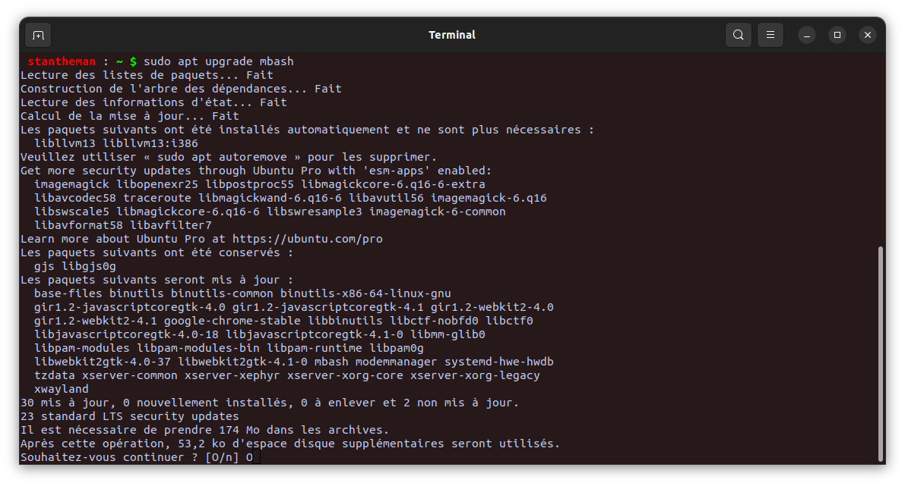

# SAE 3.03 : Réseau et application serveur

---

PIERROT Nathan

TROHA Stanislas

S3A

## 

# Partie I : MBash

## Présentation générale

Mbash est une version très réduite du vrai bash. Nous avons décidé d’utiliser execve, c’est une option bien plus intéressante (autant dans la programmation que dans l’utilisation) que system ou ses alternatives. Avec execve, contrairement à execvp, une alternative plus simple, la spécification du path est inutile car il ne va pas chercher dans le path le chemin de l’exécutable.
C’est ce pourquoi nous avons décidé d’utiliser which pour faire fonctionner execve.

La logique de fonctionnement de notre application est telle que : 

1. L’utilisateur rentre sa commande
2. Le programme la récupère et la stocke dans une variable
3. Cette variable est passée en paramètres d’une méthode recupererCheminCmd()
4. Cette méthode va utiliser popen pour exécuter un which avec le nom de la commande de l’utilsateur
5. Selon le retour du which : 
    1. S’il vaut null, alors la commande que l’utilisateur a entrée est native à bash. Dans ce cas nous avons à reprogrammer la commande (ex : cd, history…) dans notre programme mbash.c
    2. Si ne vaut pas null, retourne le chemin de l’exécutable, qu’on passera en premier paramètre de execve (et en premier indice du tableau d’arguments qu’il prend)

## Commandes & Fonctionnalités:

- help : retourne la liste des commandes disponibles
- cd : permet à l’utilisateur de se déplacer parmi ses répertoires et fichiers
- history : permet à l’utilisateur d’accéder à l’historique de ses commandes
- PS1=”\u@\w $ “ avec des doubles quotes et non des simples.
    - Option \u : Affiche le nom de l’utilisateur de la session linux courante
    - Option \w : Affiche le répertoire courant de l’utilisateur
    - Option \t : Affiche l’heure au format : heures:minutes:secondes
    - Option \d : Affiche la date en format : Nom du jour. Mois. Numéro du jour
- Commande secrète “cdd” (du style sl quand on se trompe pour écrire ls)
- CTRL + R pour ouvrir la recherche dans l’historique
- Navigation avec les flêches (du haut et du bas) pour défiler l’historique
- Auto-complétion avec la tabulation
- $$ : retourne l’identifiant du processus qui exécute mbash
- $? : retourne le code d’exécution de la dernière commande faite par l’utilisateur
- cls : clear la console
- exit : permet de fermer le programme
- CTRL + C / CTRL + D : permet de sortir du programme
- commande & : permet de lancer la commande en arrière plan
- Toutes les commandes non natives à bash sur la machine de l’utilisateur (ex : /usr/bin/ls /usr/bin/pwd etc…)


## Librairies utilisées :

- Readline : ([https://man7.org/linux/man-pages/man3/readline.3.html](https://man7.org/linux/man-pages/man3/readline.3.html)) Pour gérer les input de l’utilisateur, défiler l’historique et CTRL + R
    
    ```bash
    sudo apt-get install libreadline-dev
    ```
    
- Chafa : (https://github.com/hpjansson/chafa) Pour pouvoir afficher le gif de la commande secrète.
    
    ```bash
    sudo apt-get install chafa
    ```
    
- 

## 

# Partie II : Serveur de package Debian

Nous avons effectué les tests côté client et serveur sur la même machine pour des raisons de praticité.

## Partie serveur :

### Création du package debian

- Créer un dossier qui s’appelle mbash_version_architecturesSupportées
- Ensuite, mettre dans ce dossier deux autres dossiers s’appelant usr/bin/
- Dans mbash_0.1_all/usr/bin mettre la version compilée de mbash, s’appelant mbash
- Ensuite créer dans mbash_0.1_all un dossier DEBIAN
- Dans DEBIAN/ créer un fichier control qui contient cette config
    - control
        
        ```bash
        Package: mbash
        Version: 0.1
        Architecture: all
        Section: main
        Essential: no
        Priority: optional
        Depends: libchafa-dev, chafa, libreadline-dev
        Maintainer: PIERROT Nathan & TROHA Stanislas
        Description: Version miniature de bash créée pour la SAE 3.03
        ```
        
- Et créer un fichier postinst qui s’exécute après l’installation du package debian pour que mbash soit ajouté au path et qu’on puisse le lancer depuis n’importe où.
    - postinst
        
        ```bash
        #!/bin/bash
        set -e
        
        # On ajoue mbash au path
        echo 'export PATH=$PATH:/usr/bin' >> ~/.bashrc
        
        # On source le fichier ~/.bashrc pour que les modifications prennent directement effet
        source ~/.bashrc
        ```
        
- Ensuite il reste uniquement à construire le package avec :

```bash
dpkg-deb --build mbash_0.1_all
```

- Voici le terminal lors de l’exécution de ces étapes et ce qu’il doit retourner à la fin :


Pour l’installer il suffit de faire : 

```bash
sudo dpkg -i mbash_0.1_all.deb
```

Mais il est recommandé d’utiliser apt install pour que la gestion des dépendances soit également faite. C’est pour cela qu’on va rendre disponible l’installation du package au client via 

```bash
sudo apt install mbash
```

### Source de dépôt debian

On va commencer par générer une paire de clés gpg à l’aide de la commande : 

```bash
gpg --generate-key
```

Les informations importantes suite à cette commande sont : 

- Le nom : mbash
- La passphrase
- Et l’adresse électronique : stanislas.troha8@etu.univ-lorraine.fr
- La clé générée : 0A8425FAB84CE9321DAB79045F1B129AED506FEE


Ensuite on va devoir signer le package debian  (cette commande signe avec la première clé créée si jamais y en a plusieurs sur la machine)

```bash
dpkg-sig --sign builder mbash_0.1_all.deb
```

Cela doit retourner quelque chose comme ça après qu’on ait fourni notre passphrase : 


Nous allons maintenant passer au serveur apache.
Pour ça, on a besoin d’apache2 (dans les dépendances du package debian au cas où il ne soit pas installé)

On démarre le service avec : 

```bash
sudo service apache2 start
```

Ensuite, nous recommandons de se mettre en mode super user avec ci-dessous pour éviter les répétitons avec sudo à chaque commande

```bash
sudo su
```

Puis on crée un dossier debian dans /var/www/html et un dossier conf dans ce même dossier debian

```bash
mkdir -p /var/www/html/debian/conf
```

Puis dans /var/www/html/debian/conf on crée un fichier distributions

```bash
touch /var/www/html/debian/conf/distributions
```

Voici ce qu’il doit contenir : 

```bash
Origin: mbash
Label: mbash
Suite: stable
Codename: jammy
Version: 0.1
Architectures: i386 amd64 arm64 source
Components: main non-free contrib
Description: Version limitée qui reproduit bash
SignWith: DA45991405E9AA4AC2E746299CF6A22834C0E288
```

Pour le SignWith, on peut récupérer ses clés avec la commande : 

```bash
gpg --list-secret-keys --keyid-format LONG
```

Et on colle le code héxadécimal de la clé dans le champ SignWith

Il ne reste maintenant plus qu’à créer le dépôt avec : 

```bash
reprepro --ask-passphrase -Vb . includedeb jammy /home/stantheman/Documents/TestDebian/mbash_0.1_all.deb
```

Cela nous demandera notre passphrase pour la dernière fois, et ce sera bon.
Le résultat est tel que : 


Maintenant, nous allons nous concentrer sur la partie client pour que notre dépôt soit accessible.

Nous resterons sur la même machine.

## Partie client :

Le client va devoir exporter la clé publique du serveur (générée par RSA) dans son /usr/share/keyrings/ sous le nom de mbash.key

Pour ce faire, (comme nous sommes sur la même machine pour client et serveur) nous allons utiliser la commande : 

```bash
gpg --armor --export stanislas.troha8@etu.univ-lorraine.fr
```

et rediriger son flux dans le fichier mbash.key situé dans /usr/share/keyrings

```bash
gpg --armor --export stanislas.troha8@etu.univ-lorraine.fr > /usr/share/keyrings/mbash.key
```

A noter qu’on reste en root pour faire ça.

Maintenant on ajoute la clé qu’on a exportée à APT (Advanced Package Tool)

```bash
apt-key add /usr/share/keyrings/mbash.key
```

Puis dans /etc/apt/ on modifie le fichier sources.list pour indiquer qu’apt peut aller chercher le dépôt sur [localhost](http://localhost) (comme on utilise la même machine) sinon on aurait spécifié l’ip de la machine serveur ainsi que le port 80 utilisé par apache2 par défaut.

On ajoute cette ligne dans /etc/apt/sources.list

```bash
deb http://localhost/debian/ jammy main
```

Le fichier sources.list doit ressembler à ça (plus ou moins)


On met à jour APT : 

```bash
apt update
```

Et le client peut désormais installer bash

Un utilisateur lambda peut installer mbash à l’aide de la commande :

```bash
sudo apt install mbash
```


Il la possibilité de mettre à jour la base locale de version :

```bash
sudo apt update mbash
```

Et enfin, d’installer la nouvelle version :  

```bash
sudo apt upgrade mbash
```

Pour utiliser mbash, il suffit maintenant à l’utilisateur de taper la commande suivante dans son teminal :

```bash
mbash
```

Il peut alors exploiter toutes les fonctionnalités du mini bash.

[Capture vidéo du 21-01-2024 22:21:58.webm](images/video_1.webm)

## Scénario : cycle de vie

### Côté serveur :

On recrée un package debian v0.2 identique au v0.1 avec les modifications supplémentaires.

Donc on fera bien attention à modifier le fichier control.

 


Puis on rebuild le package avec : 

```bash
dpkg-deb --build mbash_0.2_all
```

On resigne le paquet : 

```bash
dpkg-sig --sign builder mbash_0.2_all.deb
```


```bash
reprepro -b /var/www/html/debian includedeb jammy /home/stantheman/Documents/TestDebian/mbash_0.2_all.deb
```

La passphrase nous est redemandée : 


### Côté client

Déjà faire : 

```bash
sudo apt update
```

Il ne reste plus qu’au client de télécharger les mises à jour 



Et le client, en lançant mbash obtient bien la v0.2


